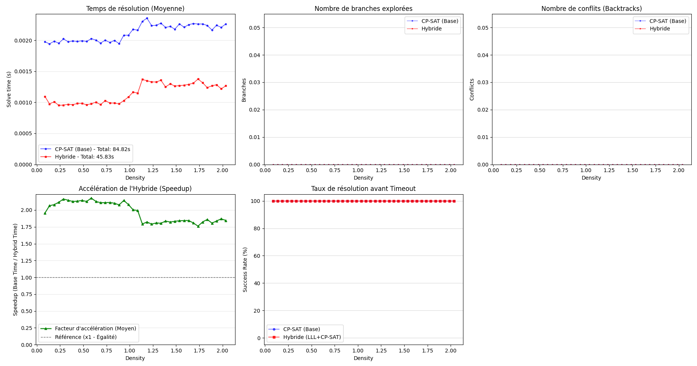
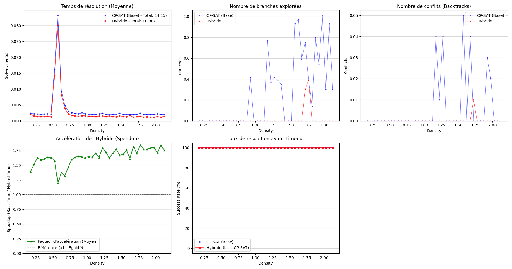
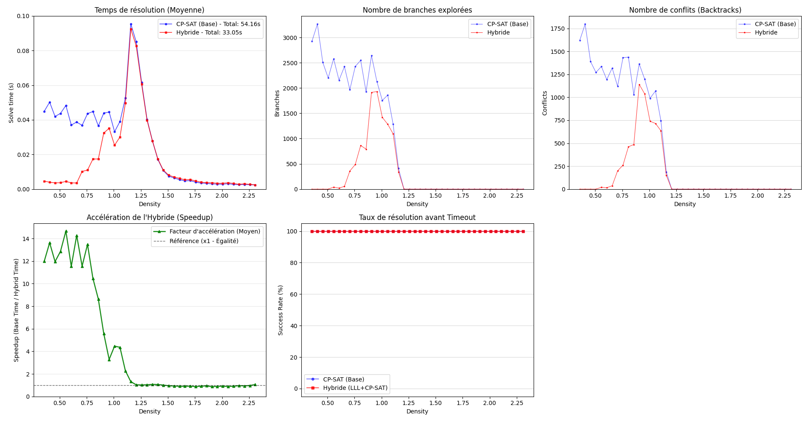
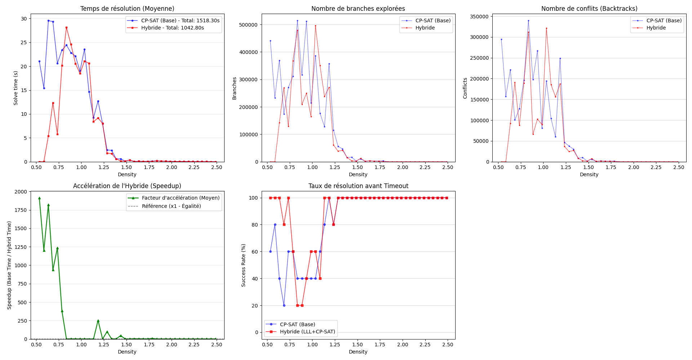
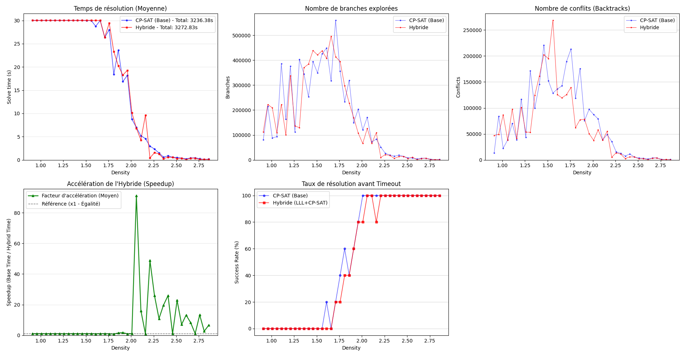
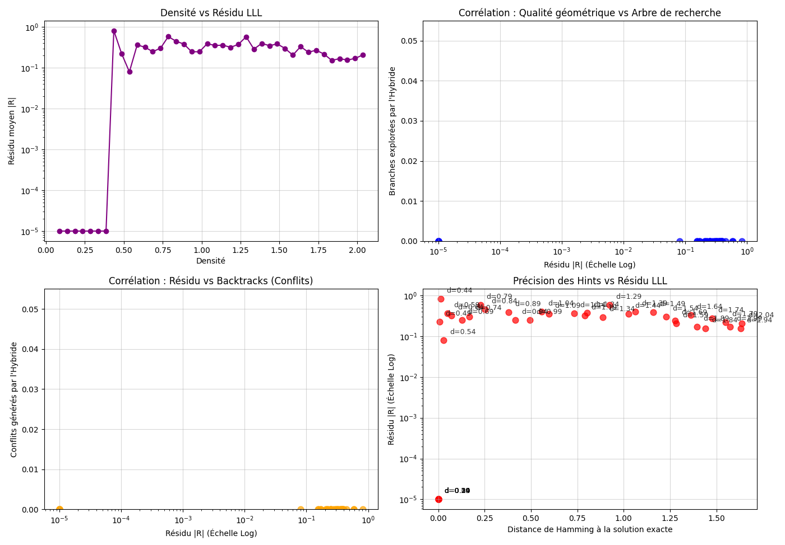
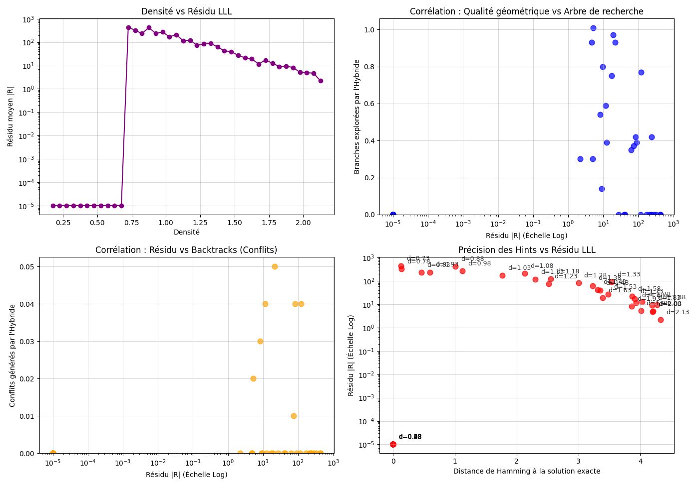
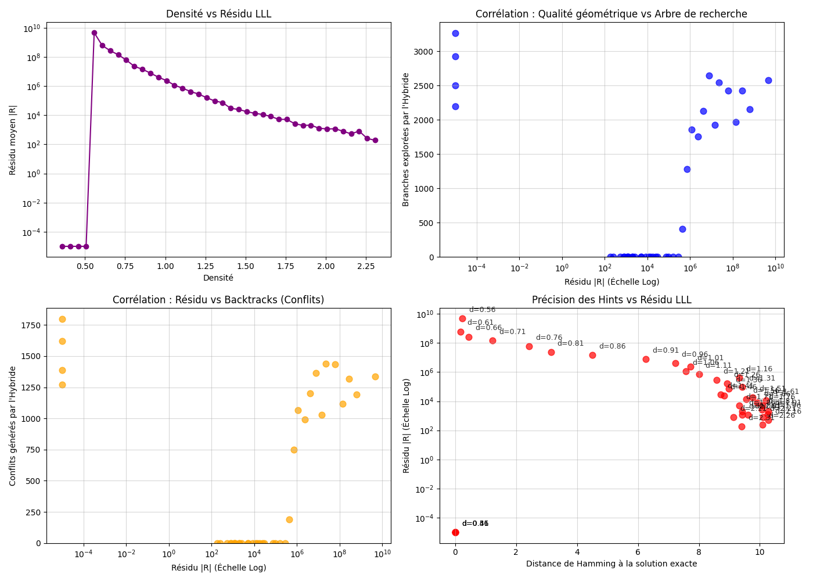
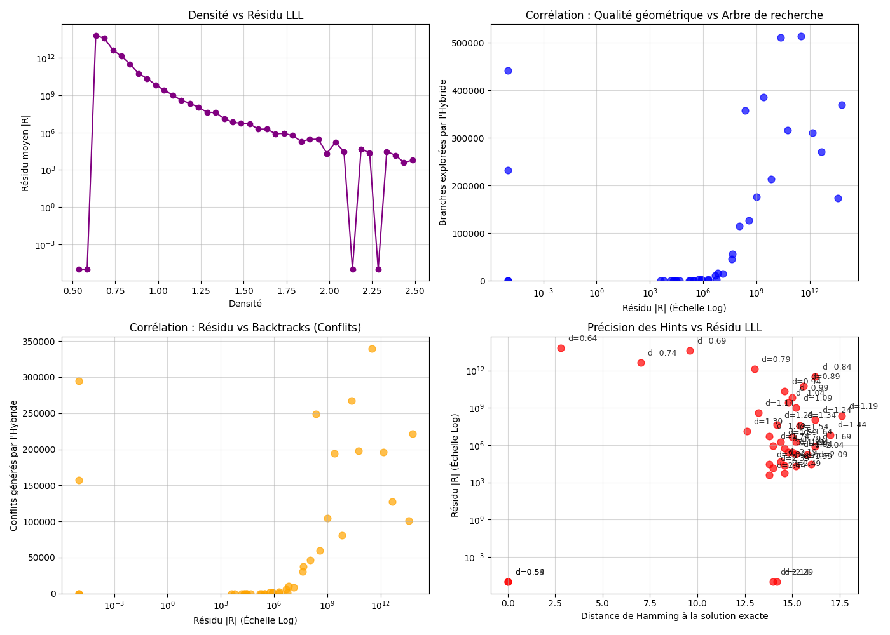
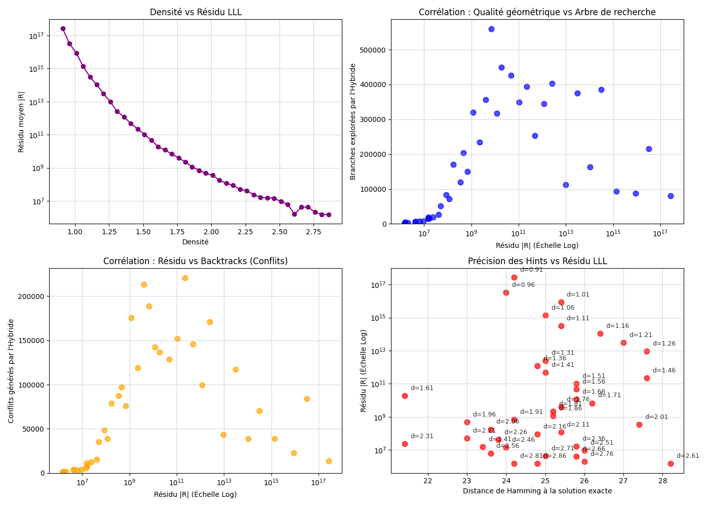

# Problème su subset sum via une approche hybride par LLL

## 0. The Subset Sum Problem

### 0.1 Definition

Given a set of integers $E$ and a target $T$, the Subset Sum problem asks whether
there exists a subset of $E$ whose elements sum to exactly $T$.

### 0.2 Examples

**No solution:**
$$E = \{3, 5, 7, 11\}, \quad T = 4$$

**Unique solution** — the subset $\{11, 13\}$:
$$E = \{1, 5, 11, 13\}, \quad T = 24$$

**Multiple solutions** — $\{1, 4\}$, $\{2, 3\}$, and $\{5\}$ are all valid:
$$E = \{1, 2, 3, 4, 5\}, \quad T = 5$$

### 0.3 Formal Formulation

Let $E = \{a_1, \ldots, a_n\} \subset \mathbb{Z}$ and $T \in \mathbb{Z}$.

For each element $a_i$, we introduce a binary decision variable:
$$x_i = \begin{cases} 1 & \text{if } a_i \text{ is included in the subset} \\ 0 & \text{otherwise} \end{cases}$$

The problem then reduces to finding $x \in \{0,1\}^n$ such that:
$$\sum_{i=1}^{n} x_i \cdot a_i = T$$

### 0.4 Complexity

Subset Sum is **NP-complete**, established by Karp (1972) as a special case
of the Knapsack problem. While pseudo-polynomial dynamic programming algorithms
exist in $O(nT)$, they become intractable as $n$ and $T$ grow — motivating
the hybrid approach developed in this project.

## 1. Complexity and Density

### 1.1 Density

The difficulty of a Subset Sum instance is not uniform — it depends heavily on
the ratio between the number of elements and the magnitude of the weights.
This is captured by the **density**, introduced by Lagarias and Odlyzko (1985):

$$d = \frac{n}{\log_2(\max_i \, a_i)}$$

Intuitively, low density means the weights are large relative to $n$, making
the problem highly constrained and paradoxically easier for lattice-based methods.
High density means the weights are small, and the problem becomes easier for
combinatorial solvers.

The critical threshold $d \approx 1$ marks the **phase transition** where
instances are hardest for most algorithms.

### 1.2 CP-SAT Approach

We model the problem as a constraint satisfaction problem and solve it with
**OR-Tools CP-SAT**, Google's state-of-the-art constraint programming solver.
The model is straightforward:

- **Variables:** $x_i \in \{0, 1\}$ for $i = 1, \ldots, n$
- **Constraint:** $\sum_{i=1}^{n} a_i \cdot x_i = T$

CP-SAT applies a combination of propagation, clause learning, and LP relaxation
to prune the search tree. It serves as our **baseline** throughout the benchmarks.

### 1.3 Instance Generation

To benchmark across densities, we generate instances with a controlled density
parameter using the following procedure:

Given a target density $d$ and dimension $n$, we set:
$$M = \lfloor 2^{n/d} \rfloor$$

then sample weights uniformly in $[1, M]$, draw a random binary solution
$x^* \in \{0,1\}^n$, and compute $T = \sum_i a_i x_i^*$. This guarantees
a known solution exists by construction.

```python
def get_instance(n, density):
    MAX = int(2 ** (n / density))
    weights = [random.randint(1, MAX) for _ in range(n)]
    solution = [random.randint(0, 1) for _ in range(n)]
    T = sum(weights[i] * solution[i] for i in range(n))
    return weights, T, solution
```

**Overflow prevention.** CP-SAT uses 64-bit integers internally. To avoid
overflow, we enforce a minimum density:

$$d_{\min}(n) = \frac{n}{63 - \log_2(n) - 2}$$

Any density below this threshold would produce weights exceeding the 64-bit
integer limit and is rejected.

```python
def get_min_density(n):
    return n / int(63 - math.log2(n) - 2)
```

## 2. Phase Transition and Motivation for a Hybrid Approach

### 2.1 Phase Transition in CP-SAT

Fixing $n$ and varying $d$ reveals a sharp **phase transition** in CP-SAT's
behavior. For high densities ($d \gg 1$), the weights are small and the search
space is heavily constrained — CP-SAT resolves instances almost instantly.
For low densities ($d \ll 1$), weights are large and instances become
combinatorially hard: the number of branches and conflicts explodes, and
CP-SAT frequently times out.

This transition is not gradual. Around $d \approx 1$, solve time peaks sharply
before collapsing — a signature of NP-hard phase transitions observed across
many combinatorial problems (SAT, TSP, graph coloring).

This motivates looking for a complementary approach that is strong precisely
where CP-SAT is weak: **low density**.

### 2.2 Why LLL?

The **LLL algorithm** (Lenstra–Lenstra–Lovász, 1982) is a polynomial-time
algorithm for lattice basis reduction. Given a lattice basis, it produces a
reduced basis whose first vector approximates the shortest vector in the lattice.

LLL has a rich history in cryptanalysis — it breaks knapsack-based cryptosystems
(Shamir, 1984; Coster et al., 1992) by exploiting the lattice structure of
subset sum instances at **low density**. The key insight is that the solution
vector $x^* \in \{0,1\}^n$ corresponds to a short vector in a well-chosen lattice,
and LLL can recover it directly when $d$ is small enough.

This is precisely the regime where CP-SAT struggles — making LLL and CP-SAT
**naturally complementary**.

### 2.3 The Knapsack Lattice

Given weights $a_1, \ldots, a_n$ and target $T$, we embed the problem into a
lattice via the following $(n+1) \times (n+1)$ matrix:

$$B = \begin{pmatrix} a_1 & 1 & 0 & \cdots & 0 \\ a_2 & 0 & 1 & \cdots & 0 \\ \vdots & & & \ddots & \vdots \\ a_n & 0 & 0 & \cdots & 1 \\ -T & 0 & 0 & \cdots & 0 \end{pmatrix}$$

```python
def knapsack_matrix(liste, T, M=1):
    n = len(liste)
    A = [[0] * (n + 1) for _ in range(n + 1)]
    for i in range(n):
        A[i][0] = liste[i] * M
        A[i][i + 1] = 1
    A[n][0] = -T * M
    return IntegerMatrix.from_matrix(A)
```

If $x^* \in \{0,1\}^n$ is a solution, then the vector
$v = \sum_{i=1}^n x_i^* \cdot B_i + B_{n+1}$ satisfies $v[0] = 0$, meaning the
first coordinate cancels exactly. The remaining coordinates encode $x^*$ directly.
This short, structured vector is what LLL attempts to find.

After reduction, we extract the coefficient submatrix — discarding the first
column — and scan for binary vectors:

```python
def extract_coefficient_submatrix(matrix):
    return [
        [matrix[j][i + 1] for i in range(matrix.ncols - 1)]
        for j in range(matrix.nrows)
    ]
```

### 2.4 Worked Example

```
weights = [575, 436, 1586, 1030, 1921, 569, 721, 1183, 1570]
T = 6665
```

The knapsack matrix $B$ before reduction:

```
[   575  1  0  0  0  0  0  0  0  0 ]
[   436  0  1  0  0  0  0  0  0  0 ]
[  1586  0  0  1  0  0  0  0  0  0 ]
[  1030  0  0  0  1  0  0  0  0  0 ]
[  1921  0  0  0  0  1  0  0  0  0 ]
[   569  0  0  0  0  0  1  0  0  0 ]
[   721  0  0  0  0  0  0  1  0  0 ]
[  1183  0  0  0  0  0  0  0  1  0 ]
[  1570  0  0  0  0  0  0  0  0  1 ]
[ -6665  0  0  0  0  0  0  0  0  0 ]
```

After LLL reduction, the coefficient submatrix contains 10 short vectors.
Only one is binary:

```
[1, 0, 1, 1, 0, 0, 1, 1, 1]
```

Verification: $575 + 1586 + 1030 + 721 + 1183 + 1570 = 6665$ ✓

LLL recovered the exact solution directly, without any search.

## `solve_lll(weights, T, sol)`

Hybrid solver combining LLL lattice reduction with CP-SAT constraint programming
for the Subset Sum problem.

### Strategy

1. **LLL reduction** — builds the knapsack lattice matrix and applies LLL reduction
   to extract short vectors from the reduced basis.

2. **Binary candidate extraction** — filters vectors whose coefficients are all 0
   or 1, making them directly interpretable as subset candidates.

3. **Guided CP-SAT** — if binary candidates exist, they are sorted by residual
   `|sum(weights * hint) - T|` and injected as hints into CP-SAT, best first.
   Each hint is given a micro-timeout of 2 seconds. The first feasible solution
   found is returned immediately.

4. **Fallback** — if no binary candidate yields a solution, CP-SAT is run without
   any hint using the remaining time budget. This guarantees the hybrid is never
   worse than vanilla CP-SAT.

### Properties

- **No regression by design** — always at least as good as CP-SAT alone.
- **Direct resolution** — when LLL finds an exact solution (residual = 0),
  CP-SAT is not needed at all.
- **Speedup up to x3600** observed empirically for low-density instances where
  CP-SAT alone times out.

### Returns

`(time, branches, conflicts, status, solution, label, best_res, best_ham)`

| Field       | Description                                                         |
| ----------- | ------------------------------------------------------------------- |
| `time`      | Total wall-clock time including LLL reduction                       |
| `branches`  | Total CP-SAT branches explored                                      |
| `conflicts` | Total CP-SAT conflicts generated                                    |
| `status`    | CP-SAT status code                                                  |
| `solution`  | List of 0/1 values, or `None` if unsolved                           |
| `label`     | Resolution path (`Binary_Hint_k`, `Standard_Fallback`, `Timeout_*`) |
| `best_res`  | Best residual found among binary candidates                         |
| `best_ham`  | Hamming distance of best candidate to reference solution            |

## 3. Experimental Results

All benchmarks were run with a 30-second timeout per instance.
Statistical significance was verified with p < 0.001 on 100–1000 runs
depending on instance size.

### 3.1 Summary Table

| n   | Max Speedup | LLL phase transition    | Hybrid success rate | Notes                                         |
| --- | ----------- | ----------------------- | ------------------- | --------------------------------------------- |
| 5   | x2.0        | d ≈ 0.45                | 100%                | No branching — propagation only               |
| 10  | x1.8        | d ≈ 0.68                | 100%                | First branching observed                      |
| 20  | x15         | d ≈ 0.55                | 100%                | Toxic zone appears at d=1.1–1.25              |
| 30  | x3600       | d ≈ 0.60                | 100% for d>1.25     | CP-SAT fails at 20–40% for d<1.25             |
| 50  | x90         | d < 0.55 (out of range) | 100% for d>2.0      | LLL finds no binary candidate in tested range |

### 3.2 Performance







The hybrid solver consistently outperforms vanilla CP-SAT in the low-density
regime. The speedup grows exponentially with n — from x2 at n=5 to x3600 at
n=30 — reflecting the exponential hardness of low-density instances for
branch-and-bound solvers.

The **no-regression guarantee** holds empirically across all tested sizes:
the hybrid never performs worse than CP-SAT alone, by construction of
`solve_lll` which falls back to vanilla CP-SAT when no useful hint is found.

### 3.3 LLL Geometry







**LLL phase transition.** The residual |R| exhibits a sharp phase transition
at a critical density d\*(n). Below this threshold, LLL finds the exact
solution directly (residual ≈ 0, Hamming distance = 0). Above it, the
residual jumps by several orders of magnitude.

| n   | d\*(n) |
| --- | ------ |
| 5   | ≈ 0.45 |
| 10  | ≈ 0.68 |
| 20  | ≈ 0.55 |
| 30  | ≈ 0.60 |

**Original observation — residual predicts CP-SAT difficulty.**
A strong correlation exists between the LLL residual |R| and the number of
branches explored by CP-SAT: low residual → few branches → fast resolution.
This suggests the residual can serve as a proxy for instance hardness,
independently of density.

**Absolute residual does not measure hint quality.** At low density,
the weights are large by construction, making |R| large even when the hint
is near-perfect (Hamming distance 0–2). The residual is a scale-dependent
quantity and should be normalized by sum(a) or max(a) for cross-density
comparison.

### 3.4 Direct Binary Candidates

When LLL finds a binary candidate with residual = 0, the nature of that
candidate depends on density:

| Density | % instances with direct candidate | % exact solution |
| ------- | --------------------------------- | ---------------- |
| d < 1.0 | 3–5%                              | **100%**         |
| d = 1.5 | 10.5%                             | 9.5%             |
| d = 1.9 | 28.5%                             | 1.8%             |

Below d = 1, the subset sum problem has a unique solution with high
probability — if LLL finds a binary candidate, it is necessarily the
exact solution. Above d = 1, multiple solutions exist (averaging ~10
at d=1.5, ~31 at d=1.9), and LLL finds valid alternative solutions
rather than the reference one.

### 3.5 Hint Quality Analysis

A key finding of this work is that measuring hint quality against a
single reference solution systematically underestimates true hint quality.
When comparing against all enumerated solutions, a consistent bias of
**~4.7 bits** is observed for d ≥ 1.5 at n=30.

| Density | Ham. vs reference | Ham. vs best solution | Bias |
| ------- | ----------------- | --------------------- | ---- |
| 1.25    | 14.91             | 13.61                 | 1.30 |
| 1.5     | 15.04             | 10.45                 | 4.59 |
| 1.75    | 14.70             | 10.02                 | 4.68 |
| 1.9     | 14.89             | 10.21                 | 4.69 |
| 2.0     | 14.93             | 10.23                 | 4.70 |

Furthermore, **100% of instances** at d ≥ 1.5 have at least one projected
hint within Hamming distance 13 = n/2 − 2 of a valid solution, confirming
that LLL hints are systematically better than random in this regime.

### 3.6 Key Limitations

- The LLL phase transition shifts toward lower densities as n grows —
  for n=50, no binary candidate is found in the tested range (d > 0.9).
- In the intermediate zone (d ≈ 0.75–1.25 for n=30), hints can be
  toxic — CP-SAT follows a bad hint and wastes budget before the fallback
  activates.
- The absolute residual is a poor predictor of hint quality across
  different densities and instance sizes without normalization.

### 3.7 Perspectives

- **Adaptive residual filtering** — normalize |R| by sum(a) to build
  a scale-invariant injection criterion.
- **BKZ reduction** — stronger than LLL, pushes the phase transition
  to higher densities, potentially recovering the hybrid advantage for
  larger n.
- **Projected hints** — injecting clipped projections of non-binary
  LLL vectors as CP-SAT hints, shown empirically to be within n/2−2
  of a valid solution in 100% of cases for d ≥ 1.5.
- **Structured instances** — benchmarking on superincreasing sequences,
  symmetric instances, and real-world knapsack data.
- **Adaptive timeout allocation** — allocating micro-timeout proportional
  to hint residual, investing more time on promising hints.
